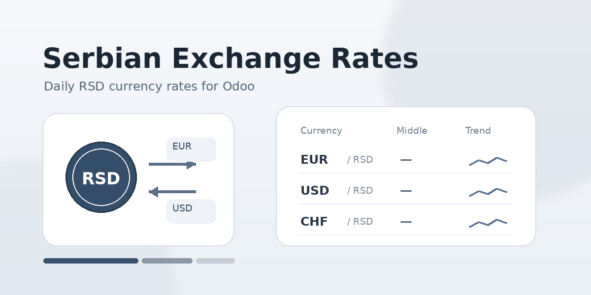
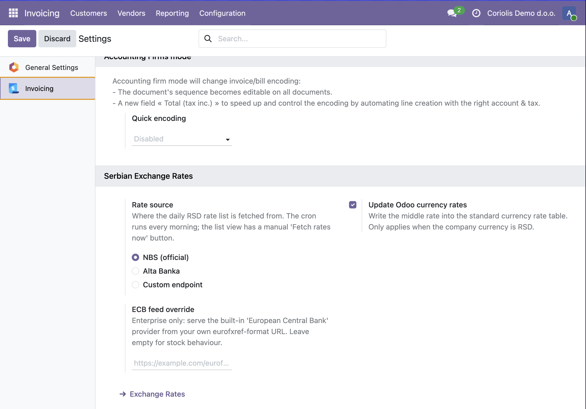
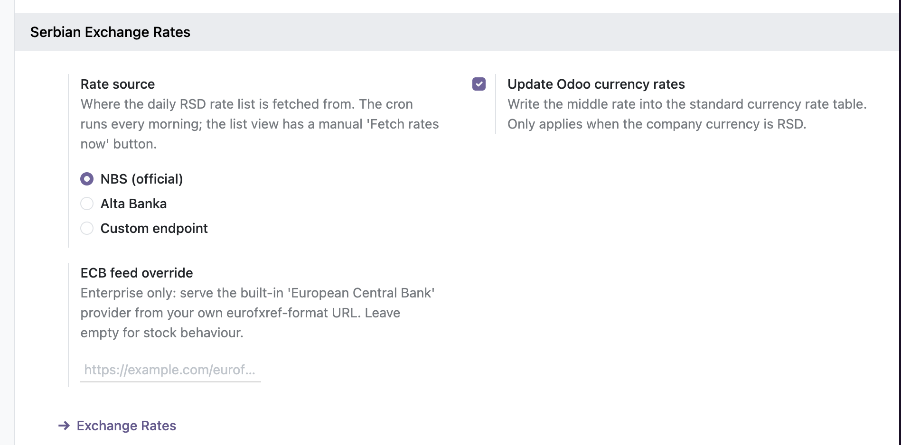
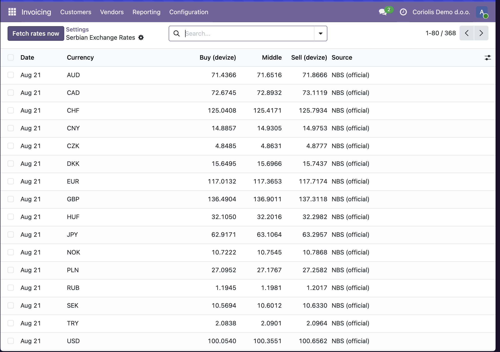

# Serbian Exchange Rates for Odoo 19

Free Odoo module (`serbian_fx`, LGPL-3) bringing daily RSD exchange rates
into Odoo: the **official National Bank of Serbia list by default**, with
selectable commercial bank sources (currently **Alta Banka**) and custom
endpoints. All five published rates stored daily, the middle rate wired into
standard multicurrency accounting, full history.

The module only *consumes* rate sources — it exposes no API of its own. A
companion standalone service lives in
[Coriol-is/alta-fx-api](https://github.com/Coriol-is/alta-fx-api): the Alta
scraper with its own store and HTTP API, usable as a `custom` source here
and as an ECB-format feed for stock Odoo.

## Features

- **Daily rates** — scheduled action (07:30 server time) fetches the current
  list from the configured source: buy / middle / sell for wire transfers
  (*devize*) and buy / sell for cash (*efektiva*), per currency, with quote
  parity (e.g. JPY is quoted per 100). Idempotent upserts; every row carries
  its `source`.
- **Sources** — `nbs` (official list, default), `alta` (commercial spreads
  scraped from altabanka.rs), `custom` (any endpoint returning the JSON
  contract below). All Serbian sources publish the same middle rate: a
  bank's *srednji kurs* is the NBS middle (verified to the fourth decimal),
  so switching sources never changes what lands in accounting — only the
  stored spreads differ.
- **Accounting integration** — the middle rate is written into
  `res.currency.rate` (global, `company_id = False`), the table Odoo itself
  uses everywhere, so multicurrency invoicing, bills, pricelists, eCommerce
  and reporting convert at the official rate with nothing else to wire up.
  Designed for **RSD** company currency: `rate = unit / middle`; skipped
  with a warning otherwise.
- **Settings page** — *Accounting → Configuration → Settings → Serbian
  Exchange Rates*: pick the source, set the custom endpoint, toggle the
  currency-rate sync, override the ECB feed. No developer mode needed.
- **History** — one `rs.fx.rate` record per currency per day, never deleted.
  Browse under *Accounting → Configuration → Serbian Exchange Rates*;
  manual refresh via the *Fetch rates now* button.
- **Backfill** — historical rates from the official NBS list for any period.

## Install

1. Copy/symlink `serbian_fx` into your addons path (or install from the
   Odoo Apps store).
2. Set the company currency to **RSD** and enable multi-currency in
   *Accounting → Configuration → Settings*.
3. Activate the currencies you need in *Accounting → Configuration →
   Currencies* (only active currencies are stored).
4. Install **Serbian Exchange Rates**. Done — NBS rates flow immediately,
   every morning at 07:30 server time.



*Accounting → Configuration → Settings → Serbian Exchange Rates.*

## Multicurrency invoicing

Supported out of the box, because the module feeds Odoo's own exchange-rate
table rather than a private one. An EUR customer invoice, a USD vendor bill,
a foreign-currency pricelist in the shop or in events all convert at the NBS
rate published for that document's date.

Two caveats worth knowing:

- **Middle rate only.** Odoo stores a single rate per currency per day, so
  conversion always uses the NBS *srednji kurs*. Bank buy/sell spreads stay
  in the module's own table for reference and reporting — Odoo will not use
  them for document conversion.
- **Community has no built-in alternative.** Automatic Currency Rates is an
  Enterprise feature, so on Community the choice is this module or typing
  rates in by hand. On Enterprise the module can also feed the stock ECB
  provider instead — see `rs_fx.ecb_url` below.

## Configuration

*Accounting → Configuration → Settings → **Serbian Exchange Rates***: rate
source, custom endpoint URL, currency-rate sync toggle and the ECB feed
override. The form writes the system parameters below, so instances
configured by hand keep working unchanged.



| Parameter | Default | Effect |
|---|---|---|
| `rs_fx.rate_source` | `nbs` | `nbs` — official NBS list via the [kurs.resenje.org](https://kurs.resenje.org) mirror. `alta` — Alta Banka commercial list scraped from altabanka.rs. `custom` — endpoint from `rs_fx.custom_url`. |
| `rs_fx.custom_url` | unset | URL returning the JSON contract below; required when source is `custom`. |
| `rs_fx.update_currency_rates` | `1` | Set `0` to keep the rates in their own table without touching `res.currency.rate`. |
| `rs_fx.ecb_url` | unset | Redirect the stock ECB provider of Automatic Currency Rates to an ECB-format feed you host (e.g. [alta-fx-api](https://github.com/Coriol-is/alta-fx-api)'s `/eurofxref-daily.xml`). Unset = stock behaviour. |

## Custom source contract

With `rs_fx.rate_source = custom`, the module GETs `rs_fx.custom_url` and
expects:

```json
{
  "rates": [
    {"currency": "EUR", "date": "2026-08-19", "unit": 1,
     "buy": 117.0073, "middle": 117.3594, "sell": 117.7115,
     "buy_cash": 116.5379, "sell_cash": 118.1809}
  ]
}
```

Per row, `currency`, `date` (YYYY-MM-DD) and `middle` are required; the
rest defaults to zero (`unit` to 1). The
[alta-fx-api](https://github.com/Coriol-is/alta-fx-api) `/rates` endpoint
speaks exactly this contract.

## Source implementation notes

- **NBS** (default): one GET per day to the public mirror
  `kurs.resenje.org/api/v1/rates/<date>`. Official buy/sell spreads;
  some currencies are quoted middle-only.
- **Alta Banka**: the bank renders its table with wpDataTables in
  server-side mode — the page holds no data, only a daily nonce. The client
  does two HTTPS requests: `GET /kursna-lista-2/` for the nonce, then a
  DataTables `POST` to `admin-ajax.php` returning the current list as JSON.
  No browser, no HTML parsing. The nonce rotates daily; a fresh one is
  fetched on every run.
- Adding a bank = one `fetch_<bank>_rates()` in
  `serbian_fx/models/fx_client.py` plus one selection entry in
  `fx_rate.py`. The client module has no Odoo imports and runs standalone:
  `python3 serbian_fx/models/fx_client.py` prints today's NBS and Alta lists.

## Rate history

One `rs.fx.rate` record per currency per day, never deleted, browsable under
*Accounting → Configuration → Serbian Exchange Rates*. The *Fetch rates now*
button refreshes the current day on demand; every row carries the source it
came from.



## Historical backfill

Bank sites don't expose history (Alta's endpoint pins every response to the
latest date server-side), so backfill uses the official NBS list — which is
also the middle rate every bank publishes.

From odoo shell:

```python
from datetime import date
env["rs.fx.rate"]._backfill_history(date(2024, 1, 1))   # from date, to today
env.cr.commit()
```

Idempotent: existing rows are never overwritten; weekends resolve to the
preceding published list and dedupe naturally.

## Tests & CI

- `serbian_fx/tests/test_fx_client.py` — pure unit tests for all three
  source parsers (mocked HTTP, no network, no Odoo). Runs standalone:

  ```bash
  python3 serbian_fx/tests/test_fx_client.py
  ```

- `serbian_fx/tests/test_fx_rate.py` and `test_config_settings.py` — Odoo
  integration tests (sources mocked): source selection, upsert idempotency,
  `res.currency.rate` writing with parity, manual-refresh behaviour,
  settings round-trip, backfill dedupe. Run with:

  ```bash
  odoo-bin -d <test-db> -i serbian_fx --test-tags /serbian_fx --stop-after-init
  ```

GitHub Actions runs both on every push and pull request (plain Python job +
`odoo:19` container with `postgres:16`).

## Notes

- License: LGPL-3. Support: odoo@coriol.co.
